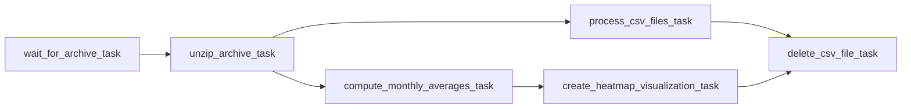

Overview
========

This project, built using the Astronomer CLI's astro dev init command, establishes a two-part pipeline system for acquiring and visualizing public domain climatological data from the National Centers for Environmental Information (NCEI). This README also serves as a guide for running the project locally using Apache Airflow.

Project Contents
================

This project consists of two pipelines (airflow DAGs) for acquiring and processing public domain climatological data from the National Centers for Environmental Information (NCEI) at https://www.ncei.noaa.gov/.

- Data Acquisition Pipeline (**fetch_ncei_data**): The Data Acquisition Pipeline receives hourly climate data from NCEI archives for temperature, precipitation, wind, etc. It includes data from 1901 to the present from approximately 13,400 US sites.

- Data Processing and Visualization Pipeline (**analytics_pipeline**): The acquired data is then processed and transformed into geospatial visualizations (maps) using appropriate tools. These maps will depict the spatial distribution of various climate parameters across the US.

## Data Description

The data includes hourly observations for various climatic parameters collected from over 13,400 stations across the US, spanning the period 1901-present. Specific parameters include:

| Parameter | Description |
|---|---|
| DryBulbTemperature | Air temperature measured by a thermometer shielded from direct sunlight. |
| Precipitation | Rainfall amount accumulated over a specific period. |
| PresentWeatherType | The type of weather condition presently occurring (e.g., rain, snow, clear sky). |
| PressureChange | The change in barometric pressure over a specific period. |
| PressureTendency | The rising or falling trend of barometric pressure. |
| RelativeHumidity | The amount of moisture in the air relative to its maximum capacity at a given temperature. |
| SkyConditions | The overall state of the sky (e.g., clear, cloudy, partly cloudy). |
| SeaLevelPressure | Atmospheric pressure adjusted to sea level. |
| StationPressure | The barometric pressure measured at the weather station's elevation. |
| Visibility | The distance at which objects can be clearly distinguished. |
| WetBulbTemperature | The temperature measured by a thermometer wrapped in a moistened cloth. |
| WindDirection | The direction from which the wind is blowing. |
| WindGustSpeed | The highest wind speed recorded in a short period. |
| WindSpeed | The speed of the wind at a specific time. |
| Sunrise | The time of sunrise on a given day. |
| Sunset | The time of sunset on a given day. |

## Pipeline Details

1. **Acquisition Pipeline**: 
Data Acquisition Pipeline ( `fetch_ncei_data` DAG ) contains the following operators
    - `download_html_data`: Fetch the page containing the location wise datasets for that year. (Bash Operator) 
    -  `select_files`: Based on the required number of data files, select the data files randomly from the available list of files. (Python Operator)
    -  `fetch_files`: Fetch the individual data files (Python Operator)
    -  `zip_files`: Zip them into an archive. (Python Operator)
    -  `move_archive`: Move the archive to the required location. (Python Operator)
    
    **Task dependencies**

2. **Processing Pipeline**: 
   Data Processing and Visualization Pipeline (`analytics_pipeline` DAG) automatically gets triggered every minute. It contains the following operator
    - `wait_for_archive`: Wait for the archive to be available (File Sensor)
    - `unzip_archive_task`: unzip contents into individual CSV files (Bash Operator)
    - `process_csv_files`: Extract CSV contents and filter data.(Python Operator using Apache Beam)
    - `compute_monthly_averages`: Compute monthly averages (Python Operator using Apache Beam)
    - `create_heatmap_visualization`: Create visualization with heatmaps (Python Operator using Apache Beam)
    - `delete_csv_file_task`: Delete CSV file

   **Task dependencies**

Deploy Your Project Locally
===========================
Prerequisites: astro and docker must be installed for this to work. 
1. Clone repository using:
    ```
    git clone https://github.com/GARYTJ29/Bigdata-Lab-A02
    ```

2. Start Airflow on your local machine by running 'astro dev start'.

    This command will spin up 4 Docker containers on your machine, each for a different Airflow component:
    - Postgres: Airflow's Metadata Database
    - Webserver: The Airflow component responsible for rendering the Airflow UI
    - Scheduler: The Airflow component responsible for monitoring and triggering tasks
    - Triggerer: The Airflow component responsible for triggering deferred tasks

3. Verify that all 4 Docker containers were created by running 'docker ps'.

    Note: Running 'astro dev start' will start your project with the Airflow Webserver exposed at port 8080 and Postgres exposed at port 5432. If you already have either of those ports allocated, you can either [stop your existing Docker containers or change the port](https://docs.astronomer.io/astro/test-and-troubleshoot-locally#ports-are-not-available).

4. Access the Airflow UI for your local Airflow project. To do so, go to http://localhost:8080/ and log in with 'admin' for both your Username and Password.

    >You should also be able to access your Postgres Database at 'localhost:5432/postgres'.

Deploy Your Project to Airflow
=================================

The File **CE20B043_Assignment_2.py** in the dags folder can be used in your airflow client's dag folder.
 A File path system `my_file_system` must also be configured for the `wait_for_archive` operator to work.
### Prerequisite Packages required:
#### Python packages
```
apache-airflow
beautifulsoup4==4.12.3
apache-beam==2.54.0
geopandas==0.14.3
geodatasets==2023.12.0
geopandas==0.14.3
matplotlib==3.8.3
```
#### OS packages
```
unzip
```

## License

This project is not licensed.

